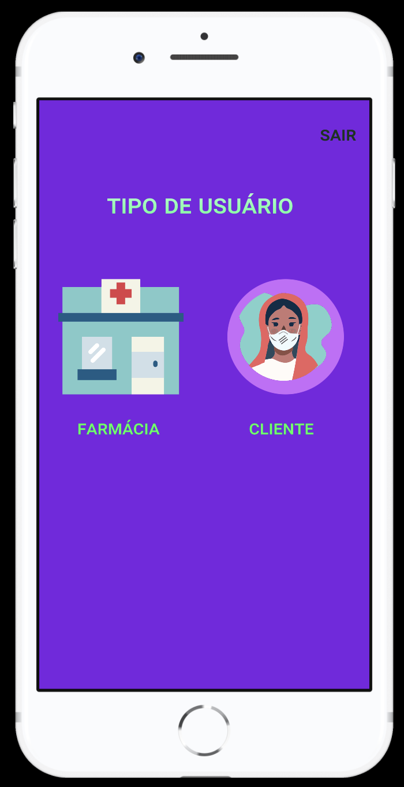
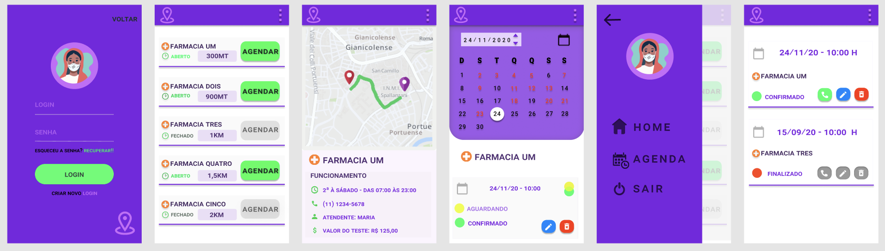
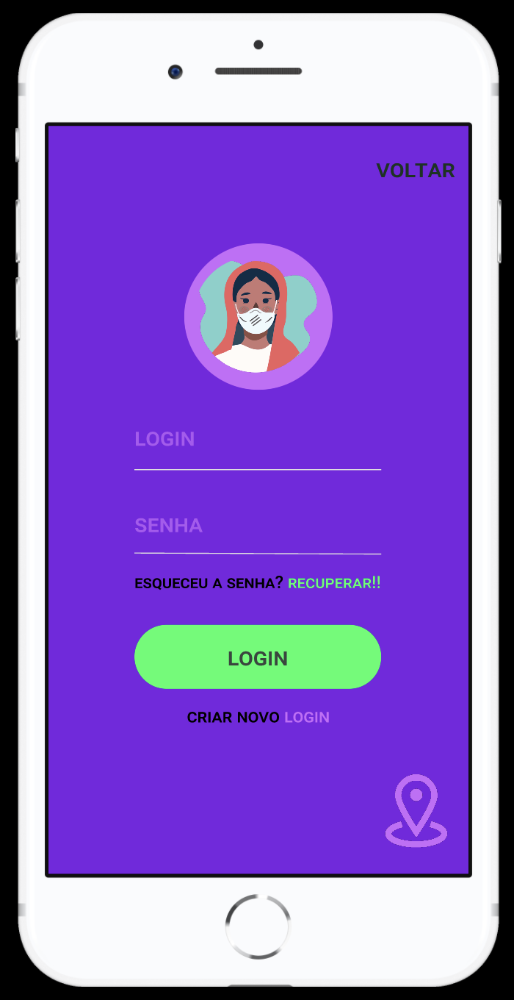
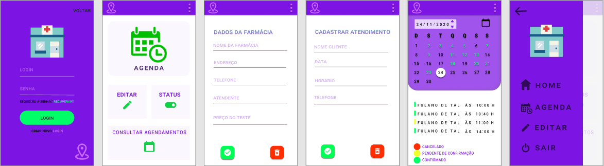
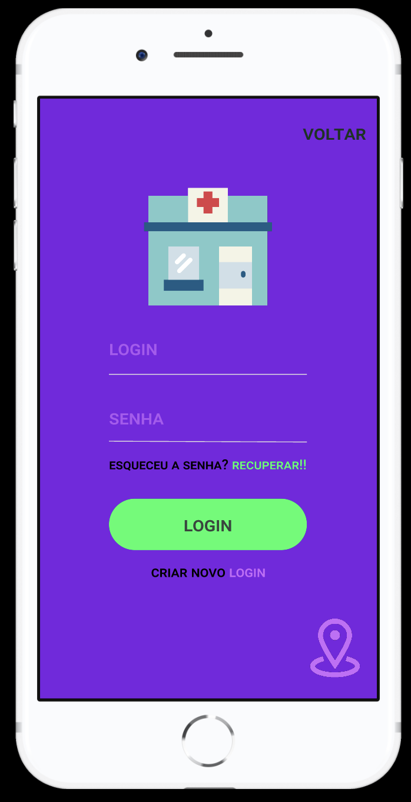

# prototipo-app-teste-covid

Prototipagem de app de celular: Teste de Covid. Trabalho do terceiro semestre de ADS.

## Ferramentas utilizadas

Todo o projeto foi feito utilizando a ferramenta online [Figma](https://www.figma.com).

O arquivo do projeto, para importação na ferramenta, encontra-se na raiz desse repositório: `prototipo.fig`.

## Fluxo de uso

Ao iniciar o app, o usuário encontra uma tela para selecionar o tipo de acesso, cliente ou farmácia.

### Fluxo de cliente

#### Tela de login

### Fluxo de farmácia

#### Tela de login

