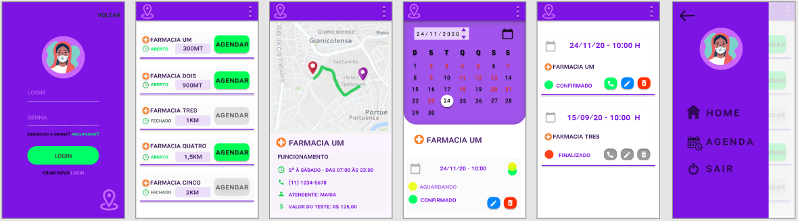
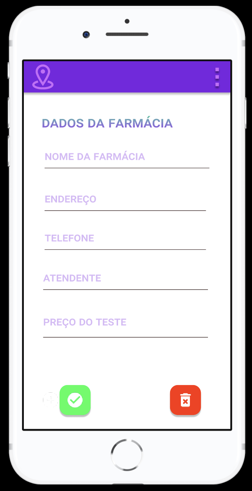

# prototipo-app-teste-covid

Prototipagem de app de celular: Teste de Covid. Trabalho do terceiro semestre de ADS.

## Ferramentas utilizadas

Todo o projeto foi feito utilizando a ferramenta online [Figma](https://www.figma.com).

O arquivo do projeto, para importação na ferramenta, encontra-se na raiz desse repositório: `prototipo.fig`.

## Fluxo de uso

Ao iniciar o app, o usuário encontra uma tela para selecionar o tipo de acesso, cliente ou farmácia.

### Fluxo de cliente

#### Tela de login

Após selecionar o acesso do gênero cliente, o usuário é levado para tela de acesso, onde é realizado o login com dados de acesso, recuperação da senha ou realizar cadastro de um novo login.

### Tela de principal

Após realizar um login com sucesso é apresentada a tela principal, onde é possível visualizar:

* Farmácias próximas.
* Distancia das farmácias.
* Status do funcionamento.
* Botão para agendar.

### Tela Inforacões sobre Farmacia

Pressionando sobre o nome da farmácia, é direcionado para mais informações sobre a selecionada, onde visualiza-se:

* Horário de funcionamento.
* Número de contato.
* Nome do atendente.
* Valor do teste.

### Tela Agendar Teste

Estando na tela principal, pressionando sobre botão "Agendar", é direcionado para tela de agendamento, onde é possível selecionar data e horário para realização do teste na farmácia desejada.

### Tela Agendados

Selecionando o ícone de Menu, na parte superior direita, é direcionado a tela de menu, na mesma, após selecionar opção "Agenda", é direcionado para a agenda onde é possível:

* Realizar contato com a farmácia.
* Editar agendamento.
* Cancelar e excluir horário marcado.

### Tela Menu

Estando na tela de menu, é possivel identificar as opções de retorno a tela principal, agenda e log off.

### Fluxo de farmácia

#### Tela de login

Após selecionar o acesso do gênero farmácia, o usuário é levado para tela de acesso, onde é possível realizar o login com dados de acesso, recuperar senha de acesso ou realizar cadastro de novo login.

#### Tela Principal

Após realizar um login com sucesso é apresentada a tela principal, onde é possível visualizar e acessar:

* Agenda.
* Dados da Farmácia.
* Status de funcionamento.
* Consultar agendamentos.
  

#### Tela de Informacoes sobre a Farmacia

Selecionando o ícone de "Editar", é direcionado para Tela de dados principais da farmácia, onde é possível editar:

* Nome da Farmácia para visualização.
* Endereço.
* Telefone para contato.
* Nome do atendente.
* Valor do Teste.

#### Tela de Agenda

Selecionando o ícone de "Agenda", é direcionado para Tela de realizar novo agendamento, ou cancelamento do novo cadastro.

#### Tela de Consultar Agendamentos

Estando na tela Principal, após selecionar opção "Consultar Agendamentos", é direcionado para os agendamentos, onde é possível:

* Visualizar por data e horário os agendamentos.
* Status do agendamento.
* Cliente agendado.

#### Tela de Menu

Selecionando o ícone de Menu, na parte superior direita, é direcionado a tela de menu, com opção de acesso a tela principal, agenda, edição dos dados da farmácia e realizar log off.

## Autores

* **Lauren Mafi** - [Github](https://github.com/laahmf)